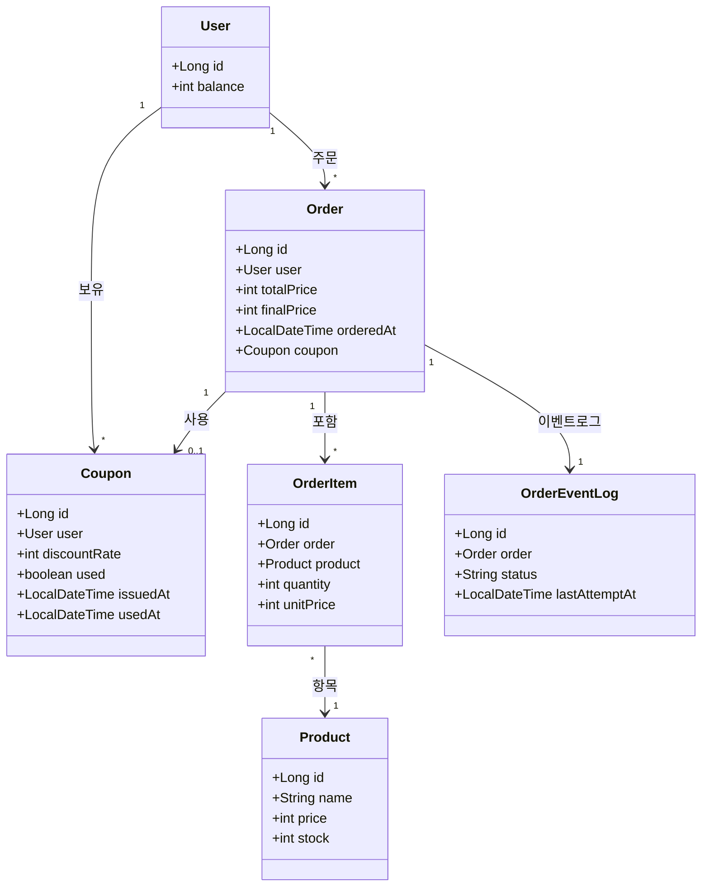

# 📦 클래스 다이어그램

```mermaid

classDiagram
    class User {
        +Long id
        +int balance
    }

    class Product {
        +Long id
        +String name
        +int price
        +int stock
    }

    class Coupon {
        +Long id
        +User user
        +int discountRate
        +boolean used
        +LocalDateTime issuedAt
        +LocalDateTime usedAt
    }

    class Order {
        +Long id
        +User user
        +int totalPrice
        +int finalPrice
        +LocalDateTime orderedAt
        +Coupon coupon
    }

    class OrderItem {
        +Long id
        +Order order
        +Product product
        +int quantity
        +int unitPrice
    }

    class OrderEventLog {
        +Long id
        +Order order
        +String status
        +LocalDateTime lastAttemptAt
    }

    User "1" --> "*" Coupon : 보유
    User "1" --> "*" Order : 주문
    Order "1" --> "*" OrderItem : 포함
    OrderItem "*" --> "1" Product : 항목
    Order "1" --> "0..1" Coupon : 사용
    Order "1" --> "1" OrderEventLog : 이벤트로그
```
