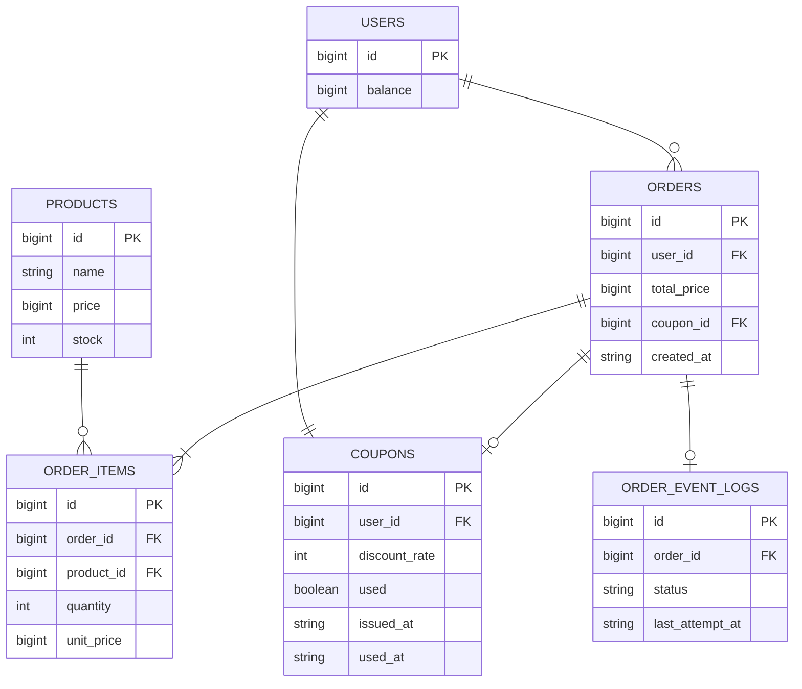

# 🧱 데이터베이스 모델링

## 1. `users`

| 필드명          | 타입       | 제약조건                         | 설명        |
| ------------ | -------- | ---------------------------- | --------- |
| `id`         | BIGINT   | PK, AUTO\_INCREMENT          | 사용자 고유 ID |
| `balance`    | BIGINT   | NOT NULL, DEFAULT 0          | 현재 충전 잔액  |
| `created_at` | DATETIME | DEFAULT CURRENT\_TIMESTAMP   | 생성 시각     |
| `updated_at` | DATETIME | ON UPDATE CURRENT\_TIMESTAMP | 갱신 시각     |

## 2. `products`

| 필드명          | 타입           | 제약조건                         | 설명       |
| ------------ | ------------ | ---------------------------- | -------- |
| `id`         | BIGINT       | PK, AUTO\_INCREMENT          | 상품 고유 ID |
| `name`       | VARCHAR(100) | NOT NULL                     | 상품 이름    |
| `price`      | BIGINT       | NOT NULL                     | 상품 가격    |
| `stock`      | INT          | NOT NULL                     | 현재 재고 수량 |
| `created_at` | DATETIME     | DEFAULT CURRENT\_TIMESTAMP   | 생성 시각    |
| `updated_at` | DATETIME     | ON UPDATE CURRENT\_TIMESTAMP | 갱신 시각    |

## 3. `orders`

| 필드명           | 타입       | 제약조건                       | 설명         |
| ------------- | -------- | -------------------------- | ---------- |
| `id`          | BIGINT   | PK, AUTO\_INCREMENT        | 주문 고유 ID   |
| `user_id`     | BIGINT   | FK → user(id)              | 주문한 사용자 ID |
| `total_price` | BIGINT   | NOT NULL                   | 최종 결제 금액   |
| `coupon_id`   | BIGINT   | FK → coupon(id), Nullable  | 사용된 쿠폰 ID  |
| `created_at`  | DATETIME | DEFAULT CURRENT\_TIMESTAMP | 주문 시각      |

## 4. `order_items`

| 필드명          | 타입     | 제약조건                | 설명           |
| ------------ | ------ | ------------------- | ------------ |
| `id`         | BIGINT | PK, AUTO\_INCREMENT | 항목 고유 ID     |
| `order_id`   | BIGINT | FK → order(id)      | 해당 주문 ID     |
| `product_id` | BIGINT | FK → product(id)    | 주문한 상품 ID    |
| `quantity`   | INT    | NOT NULL            | 주문 수량        |
| `unit_price` | BIGINT | NOT NULL            | 주문 당시의 상품 단가 |

## 5. `coupons`

| 필드명             | 타입       | 제약조건                       | 설명                |
| --------------- | -------- | -------------------------- | ----------------- |
| `id`            | BIGINT   | PK, AUTO\_INCREMENT        | 쿠폰 고유 ID          |
| `user_id`       | BIGINT   | FK → user(id)              | 쿠폰을 발급받은 사용자 ID   |
| `discount_rate` | INT      | NOT NULL                   | 할인율 (예: 10 → 10%) |
| `used`          | BOOLEAN  | DEFAULT FALSE              | 사용 여부             |
| `issued_at`     | DATETIME | DEFAULT CURRENT\_TIMESTAMP | 발급 시각             |
| `used_at`       | DATETIME | Nullable                   | 사용 시각 (사용 시 업데이트) |

## 6. `order_event_logs` *(Optional)*

> 주문 완료 후 외부 플랫폼 전송 여부를 기록하기 위한 이벤트 로그 테이블 (비동기 처리용)

| 필드명               | 타입          | 제약조건                       | 설명                            |
| ----------------- | ----------- | -------------------------- | ----------------------------- |
| `id`              | BIGINT      | PK, AUTO\_INCREMENT        | 이벤트 고유 ID                     |
| `order_id`        | BIGINT      | FK → order(id)             | 관련 주문 ID                      |
| `status`          | VARCHAR(50) | NOT NULL                   | 상태 (예: PENDING, SENT, FAILED) |
| `created_at`      | DATETIME    | DEFAULT CURRENT\_TIMESTAMP | 생성 시각                         |
| `last_attempt_at` | DATETIME    | Nullable                   | 마지막 전송 시도 시각                  |

---

## 🔗 테이블 관계도 (관계 설명)

