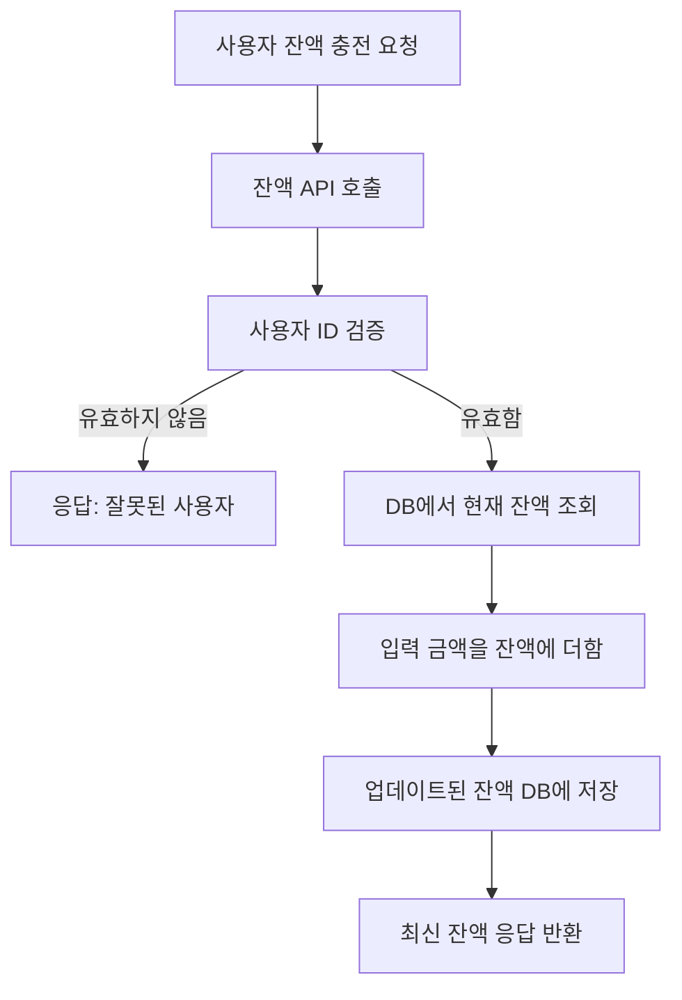
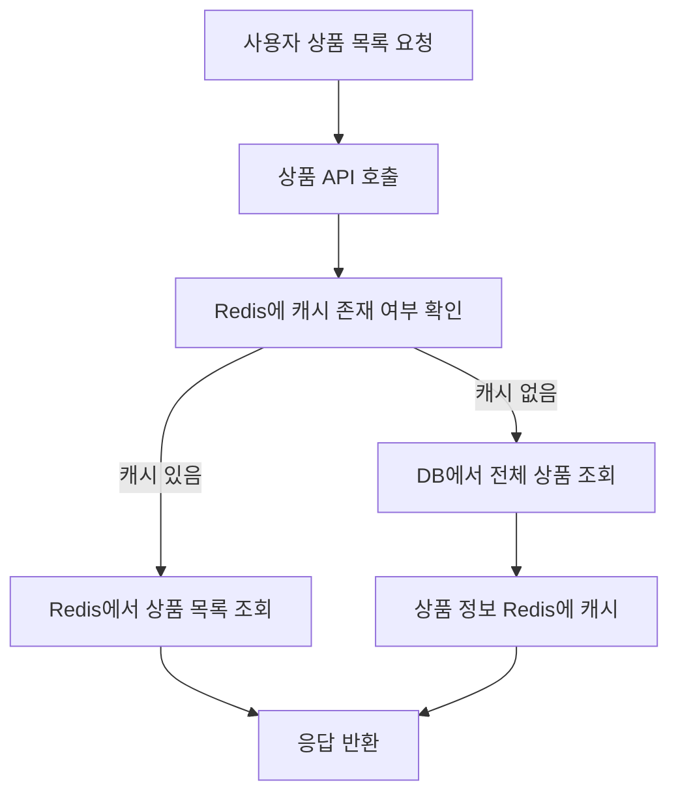
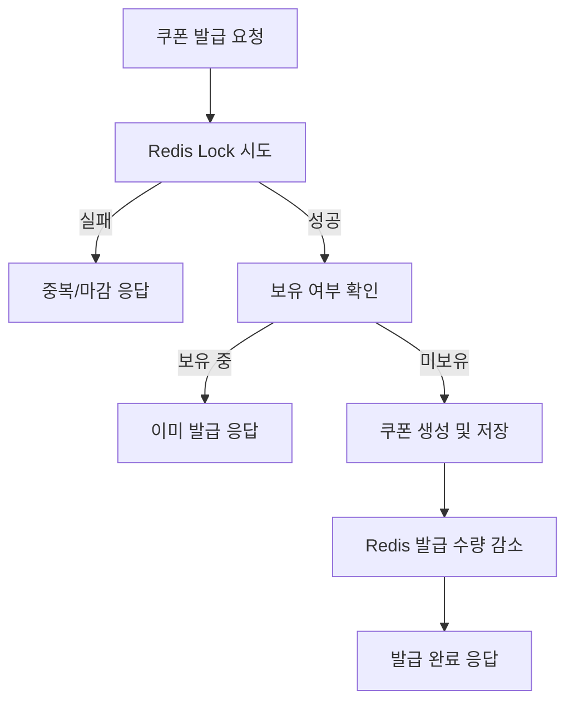
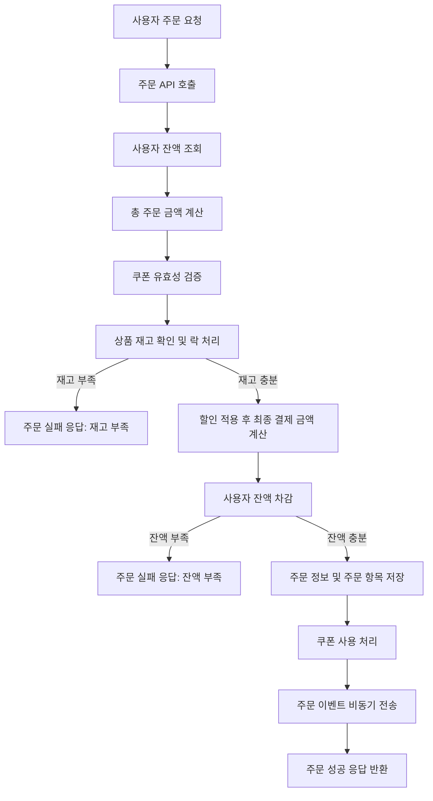
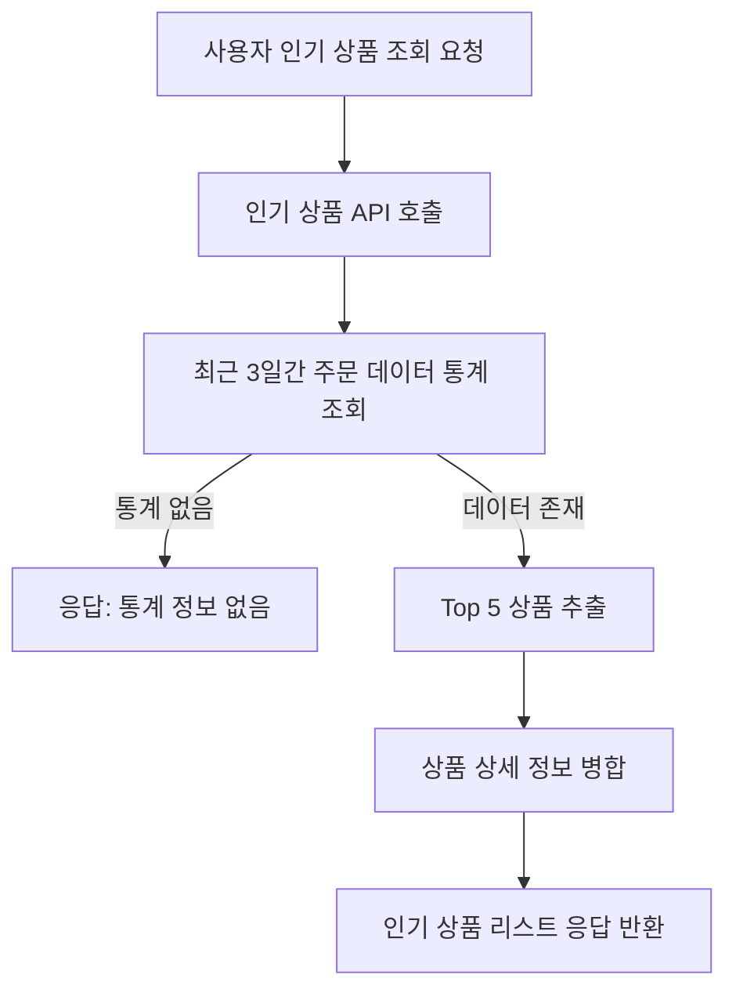

# 🗺 기능 흐름도

## 🔹 1. 잔액 충전 / 조회

* 비고: 사용자 잔액은 DB 내 별도 테이블에서 관리되며, 충전 시에는 트랜잭션으로 처리

## 🔹 2. 상품 조회

* 비고: 재고 정보는 최신 상태로 보장되어야 하며, 캐싱이 필요할 경우 주의

## 🔹 3. 선착순 쿠폰 발급

## 🔹 4. 주문 / 결제 처리

* 비고: 동시성 고려를 위해 재고 감소와 잔액 차감은 락 또는 트랜잭션 처리 필수

## 🔹 5. 인기 상품 조회

* 비고: 통계 집계는 실시간 또는 주기적 배치 전략 가능. 캐싱 전략 고려
