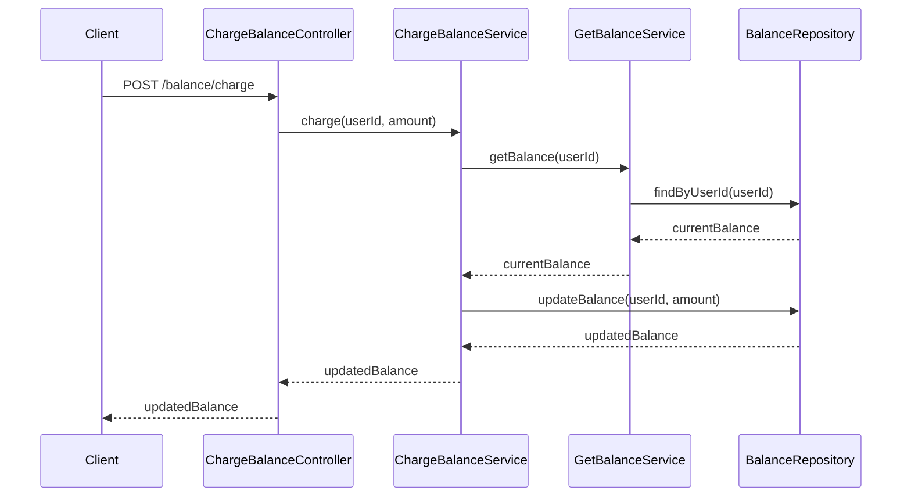
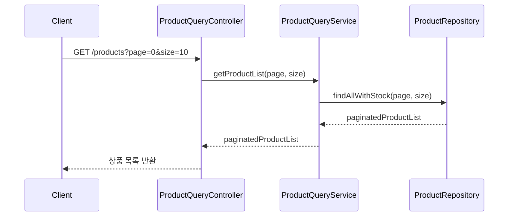
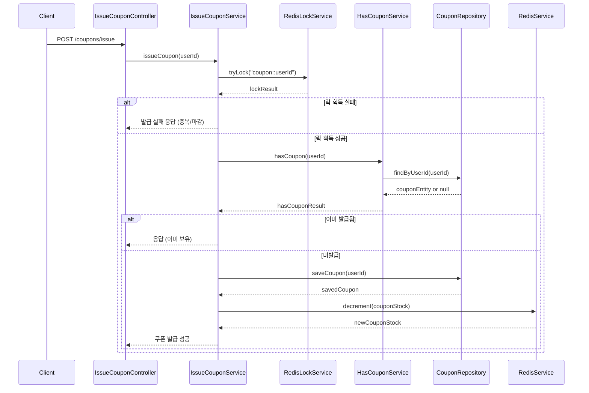
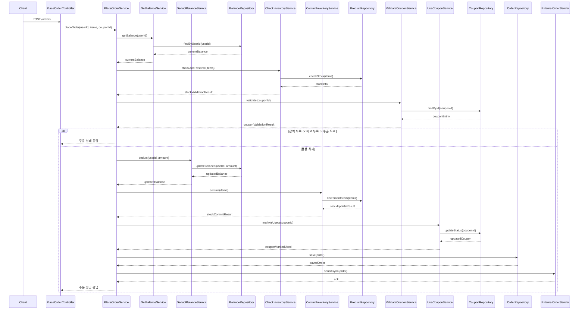
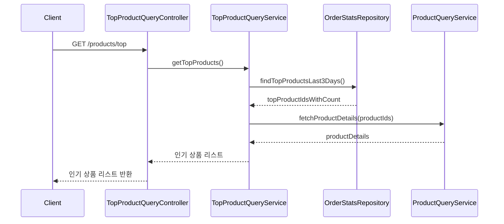

# 🔄 시퀀스 다이어그램

## 📦 시나리오 1: 잔액 충전

```mermaid
sequenceDiagram
    participant C as Client
    participant BC as ChargeBalanceController
    participant BCm as ChargeBalanceService
    participant BQ as GetBalanceService
    participant BR as BalanceRepository

    C ->> BC : POST /balance/charge
    BC ->> BCm : charge(userId, amount)
    BCm ->> BQ : getBalance(userId)
    BQ ->> BR : findByUserId(userId)
    BR -->> BQ : currentBalance
    BQ -->> BCm : currentBalance
    BCm ->> BR : updateBalance(userId, amount)
    BR -->> BCm : updatedBalance
    BCm -->> BC : updatedBalance
    BC -->> C : updatedBalance
```

---

## 📦 시나리오 2: 상품 목록 조회

```mermaid
sequenceDiagram
    participant C as Client
    participant PC as ProductQueryController
    participant PQ as ProductQueryService
    participant PR as ProductRepository

    C ->> PC : GET /products?page=0&size=10
    PC ->> PQ : getProductList(page, size)
    PQ ->> PR : findAllWithStock(page, size)
    PR -->> PQ : paginatedProductList
    PQ -->> PC : paginatedProductList
    PC -->> C : 상품 목록 반환
```

---

## 📦 시나리오 3: 선착순 쿠폰 발급

```mermaid
sequenceDiagram
    participant C as Client
    participant CC as IssueCouponController
    participant CI as IssueCouponService
    participant RL as RedisLockService
    participant CQ as HasCouponService
    participant CR as CouponRepository
    participant RS as RedisService

    C ->> CC : POST /coupons/issue
    CC ->> CI : issueCoupon(userId)
    CI ->> RL : tryLock("coupon::userId")
    RL -->> CI : lockResult
    alt 락 획득 실패
        CI -->> CC : 발급 실패 응답 (중복/마감)
    else 락 획득 성공
        CI ->> CQ : hasCoupon(userId)
        CQ ->> CR : findByUserId(userId)
        CR -->> CQ : couponEntity or null
        CQ -->> CI : hasCouponResult
        alt 이미 발급됨
            CI -->> CC : 응답 (이미 보유)
        else 미발급
            CI ->> CR : saveCoupon(userId)
            CR -->> CI : savedCoupon
            CI ->> RS : decrement(couponStock)
            RS -->> CI : newCouponStock
            CI -->> CC : 쿠폰 발급 성공
        end
    end
```

---

## 📦 시나리오 4: 상품 주문 및 결제

```mermaid
sequenceDiagram
    participant C as Client
    participant OC as PlaceOrderController
    participant OS as PlaceOrderService

    participant BQ as GetBalanceService
    participant BZ as DeductBalanceService
    participant BR as BalanceRepository

    participant IR as CheckInventoryService
    participant IC as CommitInventoryService
    participant PR as ProductRepository

    participant CQ as ValidateCouponService
    participant CC as UseCouponService
    participant CR as CouponRepository

    participant OR as OrderRepository
    participant EO as ExternalOrderSender

    C ->> OC : POST /orders
    OC ->> OS : placeOrder(userId, items, couponId)

    OS ->> BQ : getBalance(userId)
    BQ ->> BR : findByUserId(userId)
    BR -->> BQ : currentBalance
    BQ -->> OS : currentBalance

    OS ->> IR : checkAndReserve(items)
    IR ->> PR : checkStock(items)
    PR -->> IR : stockInfo
    IR -->> OS : stockValidationResult

    OS ->> CQ : validate(couponId)
    CQ ->> CR : findById(couponId)
    CR -->> CQ : couponEntity
    CQ -->> OS : couponValidationResult

    alt 잔액 부족 or 재고 부족 or 쿠폰 무효
        OS -->> OC : 주문 실패 응답
    else 정상 처리
        OS ->> BZ : deduct(userId, amount)
        BZ ->> BR : updateBalance(userId, amount)
        BR -->> BZ : updatedBalance
        BZ -->> OS : updatedBalance

        OS ->> IC : commit(items)
        IC ->> PR : decrementStock(items)
        PR -->> IC : stockUpdateResult
        IC -->> OS : stockCommitResult

        OS ->> CC : markAsUsed(couponId)
        CC ->> CR : updateStatus(couponId)
        CR -->> CC : updatedCoupon
        CC -->> OS : couponMarkedUsed

        OS ->> OR : save(order)
        OR -->> OS : savedOrder

        OS ->> EO : sendAsync(order)
        EO -->> OS : ack

        OS -->> OC : 주문 성공 응답
    end
```

---

## 📦 시나리오 5: 인기 상품 조회

```mermaid
sequenceDiagram
    participant C as Client
    participant PC as TopProductQueryController
    participant TQ as TopProductQueryService
    participant OS as OrderStatsRepository
    participant PR as ProductQueryService

    C ->> PC : GET /products/top
    PC ->> TQ : getTopProducts()
    TQ ->> OS : findTopProductsLast3Days()
    OS -->> TQ : topProductIdsWithCount
    TQ ->> PR : fetchProductDetails(productIds)
    PR -->> TQ : productDetails
    TQ -->> PC : 인기 상품 리스트
    PC -->> C : 인기 상품 리스트 반환
```
